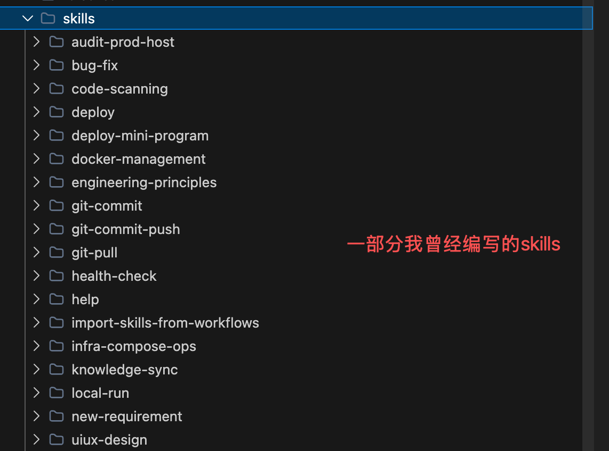

# SkillFather
创建第一个Skill之前，你需要一个能创建Skill的Skill。

如果对于本项目的原理感兴趣，可以看我博客里的本项目万字解析 https://blog.csdn.net/itkfdektxa/article/details/161311452

## 核心思想
当我耗费大量时间编写了几十个Skill之后，我意识到，我需要将我编写Skill的经验，抽象成一个通用且能被复用的skill框架。



一个优秀的skill creator首先应具备某个领域相当的专业知识，然后总结出最佳实践，抽象成SOP。

它应该至少具备

- skill用来做什么的overview
- skill的标准SOP
- skill的状态流转（state machine）
- skill的参考模板（如果有）
- skill的必要脚本资源（如果有）

所以SKILL.md中应该保持SOP中可变的部分和宏观描述，例如

* skill的名称
* skill的描述
* skill调用的时机
* skill对应的文件类型（可选）
* 提示词标准模板帮助Agent理解并将skill要做的事情转换成Todos（可选）

剩下的部分我们都应固定下来

例如我们要生成一个处理后端Java Springboot服务bug的skill

我们应该这样来描述

```markdown
---
name: java-springboot-bug-fix
description: 处理Java Springboot服务的bug
version: 1.0.0
author: system
license: Apache-2.0
---

# Bug修复

## Overview

本 skill 用于修复 Java Springboot 服务中的 bug。当用户报告后端问题、接口报错或需要修复 bug 时，Agent 应使用此 skill 来系统性地诊断和解决问题。

## 触发时机

- 用户提到"处理后端问题"、"修复bug"、"改bug"、"接口报错"等关键词
- 后端服务出现异常或错误
- API 接口返回错误状态码或异常响应

## 适用文件类型

- `.java` - Java 源代码文件
- `application.yml` / `application.properties` - Spring 配置文件
- `pom.xml` - Maven 依赖配置文件
- `build.gradle` - Gradle 构建文件

## 标准流程

1. **问题收集**
	 - 使用scripts/java-springboot-local-reboot.md启动或者重启本地springboot应用（强制）
   - 收集用户描述的问题现象，如果用户没有使用以下规范反馈bug，则建议用户使用下面的固定格式，然后继续后续任务
     ```
     建议您使用规范格式更方便agent定位问题：
     复现步骤：（详细描述您是如何稳定复现此bug的）
     xxx
     实际：（您实际看到的现象，可以贴接口response）
     xxx
     期望：（您期望的返回或行为）
     xxx
     ```
   - 按复现步骤复现后获取错误日志、堆栈信息
   - 确认问题发生的上下文（请求参数、环境等）
   
2. **问题定位**
   - 分析错误日志，定位异常代码位置
   - 检查相关代码逻辑
   - 排查配置问题

3. **根因分析**
   - 确定问题的根本原因
   - 分析代码逻辑缺陷
   - 检查依赖版本兼容性

4. **解决方案设计**
   - 设计修复方案
   - 评估方案的影响范围
   - 考虑向后兼容性

5. **代码修复**
   - 实施修复代码
   - 添加必要的注释
   - 遵循项目代码规范

6. **验证测试**
   - 编写或更新单元测试
   - 进行本地测试验证
   - 确认修复效果

7. **文档更新**
   - 更新相关文档（如需要）
   - 记录修复说明

## 状态流转
[待处理] → [问题收集中] → [问题定位中] → [根因分析中] → [方案设计中] → [代码修复中] → [验证测试中] → [已完成]


```
在上述标准化SOP中，我们应尽量识别出可以固定的部分和边界，将其脚本或资源化，供Agent直接调用。

例如改bug这个技能，分析问题原因是可变的，但是本地启动和调试的过程是不变的。

所以我们可以将本地启动编写为一个固定的脚本，并在skill的提示词中给Agent一个固定的调用模式，当然编写脚本也可以交由Agent去完成。

我们也推荐使用TDD一类的思想让验证跑在最高优先级，这个是AI时代的代码可信度验证最高的方法。

你在工程里的skills/create-skill文件夹下的SKILL.md文件中，可以清晰的看到“测试优先”的设计理念，阅读它能帮助你快速学习如何创建一个高质量的skill。


## 快速开始

### 直接复制`create-skill`技能到你的项目

如果你已经创建了自己的项目，你可以复制 `skills/create-skill` 文件夹到你的工程 ` skills`文件夹下

或者你也可以使用命令行

```
git clone https://github.com/huanqwer/SkillFather.git
cd SkillFather
cp skills/create-skill {yourSkillsDir}
```

然后在Agent对话框中告诉AI你想要创建什么样的技能

不建议在本工程里这么做，因为有你的工程上下文AI会工作的更好
