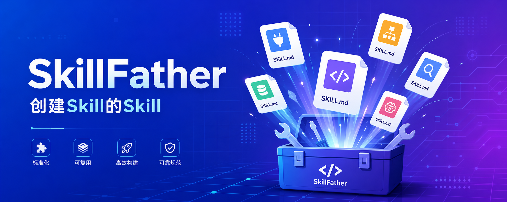
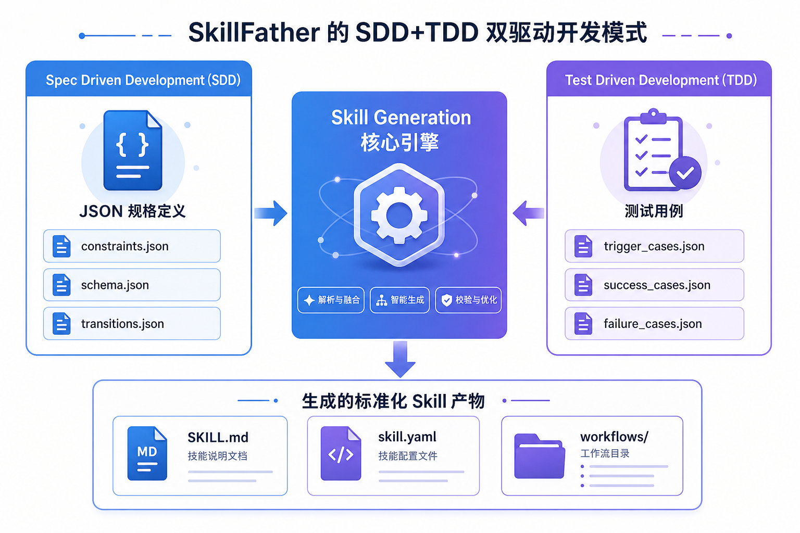
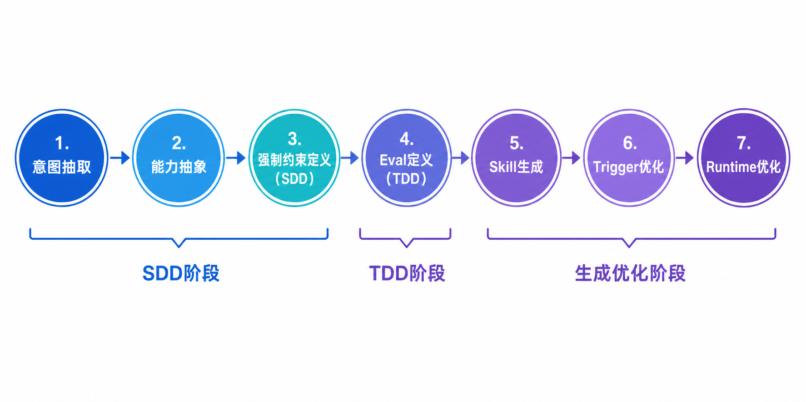

# SkillFather



创建第一个 Skill 之前，你需要一个能创建 Skill 的 Skill。

使用此 Skill 你能快速得到几乎是最佳实践标准结构的 Skill，采用 **SDD（规格驱动开发）+ TDD（测试驱动开发）** 双驱动模式，JSON 强制约束优先于自然语言提示词。

---

## 特点

- **SDD + TDD 双驱动**：先定义 JSON 强制约束（spec/），再定义 JSON Eval 测试用例（evals/），最后生成 Skill
- **JSON > Prompt**：JSON 具有机器可解析、无歧义、可程序化验证、可组合执行的约束力，远强于自然语言提示词
- **标准化目录结构**：spec/evals/workflows/scripts/references/assets 六大标准目录
- **多 Agent 兼容**：支持 Codex、Claude Code、Windsurf 等所有支持 SKILL.md 的 Agent 环境
- **状态机驱动**：7 步工作流，从意图抽取到 Runtime 优化，每步都有明确的状态转换和检查条件
- **可测试、可组合、可观测**：每个生成的 Skill 都包含完整的 Eval 测试用例和 Telemetry 钩子

---

## 安装

### 一句话安装

【推荐】可以直接把下面这句话发给你的 Agent，让它帮你安装：

```
请帮我安装 SkillFather skill，链接是：https://github.com/huanqwer/SkillFather
```

### npx 安装（推荐）

```bash
# 安装到 Codex 全局
npx -y skills@latest add huanqwer/SkillFather \
  --skill skill-father \
  --agent codex \
  --global

# 安装到 Claude Code 全局
npx -y skills@latest add huanqwer/SkillFather \
  --skill skill-father \
  --agent claude-code \
  --global
```

安装完成后，重启 Agent 让新 Skill 生效。

### git clone 安装

```bash
git clone https://github.com/huanqwer/SkillFather.git

# 方式一：复制到 Agent 全局 skills 目录
cp -r SkillFather/skills/skill-father ~/.codex/skills/skill-father

# 方式二：复制到你的项目 skills 目录
cp -r SkillFather/skills/skill-father your-project/skills/skill-father
```

### 本地开发（软链接）

如果你是在本地开发这个仓库，可以用软链接替代复制，方便实时调试修改：

```bash
mkdir -p ~/.codex/skills
ln -s /path/to/SkillFather/skills/skill-father ~/.codex/skills/skill-father
```

### 更新

```bash
# npx 方式：重新执行安装命令即可覆盖为最新版本
# git clone 方式：
cd SkillFather && git pull
```

也可以直接让 Agent 帮你更新：

```
请帮我更新 SkillFather skill 到最新版本，仓库是：https://github.com/huanqwer/SkillFather
```

---

## 使用方式

在 Agent 对话中描述你想要创建的 Skill，例如：

```
请使用 skill-father skill 帮我创建一个处理 Java Springboot 服务 bug 的 Skill。
```

Skill 会按以下流程执行：
1. 分析用户真实需求（意图抽取）
2. 将需求转换为可复用能力（能力抽象）
3. 定义 JSON 强制约束（SDD：spec/constraints.json、schema.json、transitions.json）
4. 定义 JSON Eval 测试用例（TDD：trigger_cases.json、success_cases.json 等）
5. 生成 Skill（SKILL.md、skill.yaml、完整目录结构）
6. 优化 Trigger 条件
7. Runtime 优化

---

## Skill 目录结构

使用此 Skill 你能快速得到以下是最佳实践标准结构的 Skill：

```
skill-name/
├── SKILL.md              # 必需：Skill 主文件（frontmatter 只含 name 和 description）
├── skill.yaml            # 必需：机器可读配置（trigger、inputs、outputs 等）
├── spec/                 # 必需：强制约束（SDD，JSON 格式）
│   ├── constraints.json  #   行为约束：must / must_not / preconditions / postconditions
│   ├── schema.json       #   输入输出 JSON Schema
│   └── transitions.json  #   状态转换规则（机器可读）
├── evals/                # 必需：Eval 测试用例（TDD，JSON 格式）
│   ├── trigger_cases.json
│   ├── success_cases.json
│   ├── failure_cases.json
│   └── benchmarks.json
├── workflows/            # 必需：工作流定义（YAML 格式）
│   └── state-machine.yaml
├── scripts/              # 必需：可执行脚本
├── references/           # 必需：参考文档
├── assets/               # 必需：模板和静态资源
└── README.md             # 可选：Skill 说明
```

该 Skill 会严格遵守以下原则：

- **保持SOP中可变的部分和宏观描述**：如 Skill 的名称、描述、调用时机、文件类型、提示词标准模板
- **固定可复用的部分**：将标准化流程中不变的部分脚本化或资源化，供 Agent 直接调用
- **SDD + TDD**：先定义 JSON 强制约束和 Eval 测试用例，再生成 Skill，让验证跑在最高优先级

---

## 核心思想

当我耗费大量时间编写了几十个 Skill 之后，我意识到，我需要将我编写 Skill 的经验，抽象成一个通用且能被复用的 Skill 框架。



一个优秀的 Skill Creator 首先应具备某个领域相当的专业知识，然后总结出最佳实践，抽象成 SOP。

它应该至少具备：

- Skill 用来做什么的 overview
- Skill 的标准 SOP
- Skill 的状态流转（state machine）
- Skill 的参考模板（如果有）
- Skill 的必要脚本资源（如果有）

所以 SKILL.md 中应该保持 SOP 中可变的部分和宏观描述，例如：

- Skill 的名称
- Skill 的描述
- Skill 调用的时机
- Skill 对应的文件类型（可选）
- 提示词标准模板帮助 Agent 理解并将 Skill 要做的事情转换成 Todos（可选）

剩下的部分我们都应固定下来。

### 工作流程



SkillFather 采用 7 步工作流，从意图抽取到 Runtime 优化，每步都有明确的状态转换和检查条件。

### 示例：生成一个处理后端 Java Springboot 服务 bug 的 Skill

我们应该这样来描述：

```markdown
---
name: java-springboot-bug-fix
description: 处理Java Springboot服务的bug
---

# Bug修复

## Overview

本 skill 用于修复 Java Springboot 服务中的 bug。当用户报告后端问题、接口报错或需要修复 bug 时，Agent 应使用此 skill 来系统性地诊断和解决问题。

## 触发时机

- 用户提到"处理后端问题"、"修复bug"、"改bug"、"接口报错"等关键词
- 后端服务出现异常或错误
- API 接口返回错误状态码或异常响应

## 适用文件类型

- `.java` - Java 源代码文件
- `application.yml` / `application.properties` - Spring 配置文件
- `pom.xml` - Maven 依赖配置文件
- `build.gradle` - Gradle 构建文件

## 标准流程

1. **问题收集**
   - 使用 scripts/java-springboot-local-reboot.md 启动或者重启本地 springboot 应用（强制）
   - 收集用户描述的问题现象
   - 按复现步骤复现后获取错误日志、堆栈信息

2. **问题定位**
   - 分析错误日志，定位异常代码位置
   - 检查相关代码逻辑
   - 排查配置问题

3. **根因分析**
   - 确定问题的根本原因
   - 分析代码逻辑缺陷

4. **解决方案设计**
   - 设计修复方案
   - 评估方案的影响范围

5. **代码修复**
   - 实施修复代码
   - 遵循项目代码规范

6. **验证测试**
   - 编写或更新单元测试
   - 进行本地测试验证

7. **文档更新**
   - 更新相关文档（如需要）

## 状态流转
[待处理] → [问题收集中] → [问题定位中] → [根因分析中] → [方案设计中] → [代码修复中] → [验证测试中] → [已完成]
```

在上述标准化 SOP 中，我们应尽量识别出可以固定的部分和边界，将其脚本或资源化，供 Agent 直接调用。

例如改 bug 这个技能，分析问题原因是可变的，但是本地启动和调试的过程是不变的。所以我们可以将本地启动编写为一个固定的脚本，并在 Skill 的提示词中给 Agent 一个固定的调用模式。

我们也推荐使用 SDD + TDD 的思想让验证跑在最高优先级，这是 AI 时代的代码可信度验证最高的方法。

你在工程里的 `skills/skill-father` 文件夹下的 SKILL.md 文件中，可以清晰地看到 SDD + TDD 的设计理念，阅读它能帮助你快速学习如何创建一个高质量的 Skill。

如果对于本项目的原理感兴趣，可以看我博客里的本项目万字解析 https://blog.csdn.net/itkfdektxa/article/details/161311452

---

## 许可证

[Apache-2.0](./LICENSE)

