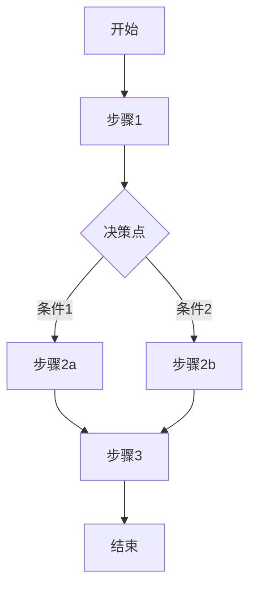

# 工作流定义模板

## 工作流图

## 状态机定义

### 状态

- `idle`: 初始状态
- `processing`: 处理中
- `success`: 成功完成
- `failure`: 失败

### 状态转换

| 当前状态 | 触发条件 | 目标状态 | 动作 |
|---------|---------|---------|------|
| idle | 收到请求 | processing | 初始化上下文 |
| processing | 处理成功 | success | 返回结果 |
| processing | 处理失败 | failure | 记录错误 |
| success | - | idle | 清理资源 |
| failure | - | idle | 清理资源 |

## 执行步骤

### Step 1: 初始化

- 输入验证
- 上下文加载
- 资源准备

### Step 2: 执行

- 核心逻辑处理
- 状态更新
- 中间结果记录

### Step 3: 完成

- 结果验证
- 输出格式化
- 资源清理
