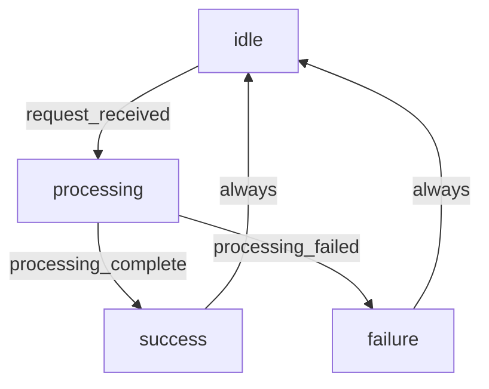

# 工作流定义模板

工作流定义必须使用 YAML 格式，存储在 `workflows/state-machine.yaml`。

---

## 标准化工作流文件结构

```
workflows/
└── state-machine.yaml      # 状态机定义（YAML 格式）
```

**注意**：状态机的机器可读版本存储在 `spec/transitions.json`（JSON 格式），`state-machine.yaml` 是人类可读的 YAML 版本，两者必须保持一致。

---

## state-machine.yaml 模板

```yaml
skill_name: skill-name
version: 1.0.0
description: Skill 工作流的状态机定义

states:
  idle:
    description: 初始状态，等待用户请求
    on_enter:
      - 初始化上下文
      - 加载配置
    on_exit:
      - 清理临时数据
    transitions:
      - to: processing
        condition: request_received
        action: initialize

  processing:
    description: 处理中状态
    on_enter:
      - 开始处理
    on_exit:
      - 保存处理结果
    transitions:
      - to: success
        condition: processing_complete
        action: complete
      - to: failure
        condition: processing_failed
        action: handle_error

  success:
    description: 成功完成状态
    on_enter:
      - 生成报告
      - 清理资源
    on_exit:
      - 重置为 idle
    transitions:
      - to: idle
        condition: always
        action: reset

  failure:
    description: 失败状态
    on_enter:
      - 记录错误
      - 生成错误报告
    on_exit:
      - 清理资源
    transitions:
      - to: idle
        condition: always
        action: reset

conditions:
  request_received:
    description: 收到用户请求
    checks:
      - input_valid
      - context_ready

  processing_complete:
    description: 处理完成
    checks:
      - output_valid
      - no_errors

  processing_failed:
    description: 处理失败
    checks:
      - error_occurred
      - or timeout

actions:
  initialize:
    description: 初始化处理
    steps:
      - 验证输入
      - 加载上下文
      - 准备资源

  complete:
    description: 完成处理
    steps:
      - 验证输出
      - 格式化结果
      - 生成报告

  handle_error:
    description: 处理错误
    steps:
      - 记录错误
      - 生成错误报告
      - 清理资源

  reset:
    description: 重置状态
    steps:
      - 清理上下文
      - 重置变量

error_handling:
  processing:
    - error: timeout
      action: handle_error
      message: "处理超时"
    - error: invalid_input
      action: handle_error
      message: "输入无效"

telemetry:
  collect:
    - state_transitions
    - action_executions
    - error_occurrences
    - latency_per_state
  report:
    - on_success: true
    - on_failure: true
```

---

## 工作流图（可选）

可以在 SKILL.md 中使用 Mermaid 图可视化工作流：



---

## 使用指南

1. **创建 workflows/ 目录**
   ```bash
   mkdir -p workflows
   ```

2. **创建 state-machine.yaml**
   - 复制上述模板
   - 定义 Skill 的状态和转换
   - 确保格式正确

3. **验证 YAML 格式**
   ```bash
   python -c "import yaml; yaml.safe_load(open('workflows/state-machine.yaml'))"
   ```

4. **在 SKILL.md 中引用**
   ```markdown
   工作流定义：workflows/state-machine.yaml
   ```

---

## 状态机设计原则

1. **状态定义清晰**：每个状态有明确的职责
2. **转换条件明确**：状态转换的条件必须可量化
3. **动作可执行**：每个动作应该是可执行的步骤
4. **错误处理完善**：每个状态都应该有错误处理
5. **遥测支持**：支持收集状态转换和动作执行的遥测数据

---

## 注意事项

- 工作流定义必须使用 YAML 格式
- 文件必须命名为 state-machine.yaml
- 状态转换必须形成闭环
- 错误处理必须覆盖所有可能的错误场景
- 遥测配置应该根据实际需求调整
